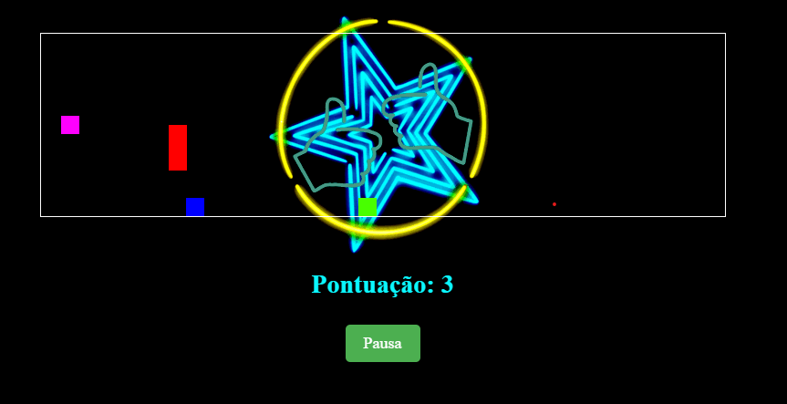

<h1 align="center"> Jump Game </h1>

  <a href="#descrição-do-projeto">Descrição do Projeto</a>&nbsp;&nbsp;&nbsp;|&nbsp;&nbsp;&nbsp;
  <a href="#tecnologias-utilizadas">Tecnologias Utilizadas</a>&nbsp;&nbsp;&nbsp;|&nbsp;&nbsp;&nbsp;
  <a href="#licença">Licença</a>&nbsp;&nbsp;&nbsp;|&nbsp;&nbsp;&nbsp;
  <a href="#autor">Autor</a>

  

## Descrição do Projeto

É um jogo simples em HTML onde um personagem pula para desviar de obstáculos. O jogador pressiona botões para fazer o personagem pular e andar, evitando os obstáculos que aparecem. O jogo tem gráficos simples e contém recursos como contagem de pontos e pausa.

## Tecnologias Utilizadas

- _Linguagens:_ HTML - CSS - JavaScript
- _Controle de Versão:_ Git
- _IDE:_ Visual Studio Code
- _Hospedagem do Código:_ GitHub

## Licença

Este projeto está sob a . Consulte o arquivo [LICENSE](./LICENSE) para obter mais detalhes.

## Autor

Feito por:
Beatriz Alves De Souza - 32217235
